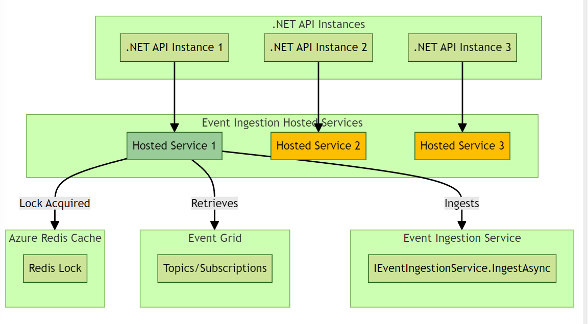

Introduction
-
*EventIngestionServices* is a .NET library designed to simplify event ingestion in .Net applications.

It provides a set of services and extensions that allow for easy setup, configuration, and ingestion of events.

Event Grid (Namespace Topics and Subscriptions) is the initial supported eventing backplane.

A .Net Hosted Service is used to periodically fetch events in batch and send on to client application for ingestion. 

Client application is required to implement a single interface *IEventIngestionService* to handle the ingestion of each single event.



Prerequistics
-
- Event Grid Namespace with Namespace Topic(s) and Subscription(s) from which to ingest events
- Azure Redis Cache instance available for distributed lock support for the hosted service.
- Existing .Net app from which you would like ingest events.

Azure Event Grid Support
--
[Event Grid Namespace Topics using Http Pull Delivery](https://learn.microsoft.com/en-us/azure/event-grid/pull-delivery-overview) are used. 

It is assumed that you have one or more Event Grid Namespace Topics and dedicated subscriptions available from which to ingest events.

Azure Redis Cache Usage
--
Azure Redis Cache is used for ensuring only a single hosted service is performing work across all available instances. 

It is assumed you have an Azure Redis Cache through which to configure the lock settings.

Setting up the Services
-
Use the AddEventGridIngestion extension method to set up the services in your .NET application's Program.cs:

```
    builder.Services.AddEventGridIngestion<MyEventIngestionService>(
        eventsIngestionHostedServiceOptions: opts => builder.Configuration.GetSection("EventsIngestionHostedService").Bind(opts),
        eventGridIngestionServiceOptions: opts => builder.Configuration.GetSection("EventGridIngestionService").Bind(opts),
        redisLockServiceOptions: opts => builder.Configuration.GetSection("RedisLockService").Bind(opts));
```

The above code registers a .Net Hosted Service which periodically ingests events from Event Grid. 

The hosted service will run on all application instances, with a Redis lock used to ensure only one instance runs at a time. 

The *MyEventIngestionService* class is the client application's implementation of IEventIngestionService, required to carry out ingestion for each individual event received. 

Configuration
-

Below is an example of how to structure configuration settings to bind to the Options required by the library services:

For {SECRET} values, secrets.json can be used locally and be replaced from Key Vault or equivalent in other environments.

```
  "EventsIngestionHostedService": {
    "PollingFrequency": "00:00:30",
    "RedisLockKey": "MyService-EventsIngestionHostedService", // ensure unique for your service
    "RedisLockTimeout": "00:05:00"
  },
  "EventGridIngestionService": {
    "NamespaceEndpoint": "{EVENT GRID NAMESPACE TOPIC ENDPOINT}",
    "EventBatchSize": 100,
    "MaxWaitTime": "00:00:10",
    "Topics": [
      {
        "Name": "customisation",
        "Key": "{SECRET}",
        "Subscriptions": [ "personalisation" ]
      },
      {
        "Name": "location",
        "Key": "{SECRET}",
        "Subscriptions": [ "personalisation" ]
      }
    ]
  },
  "RedisLockService": {
    "Host": "cachetest123.redis.cache.windows.net",
    "Port": "6380",
    "Password": "{SECRET}",
    "PrincipalId": "",
    "RetryCount": 3,
    "RetryDelay": "00:00:02", // exp back off after this
    "CircuitBreakerFailureThreshold": 0.1,
    "CircuitBreakerSamplingDuration": "00:15:00",
    "CircuitBreakerDurationOfBreak": "00:05:00",
    "CircuitBreakerMinimumThroughput": 100
  }
```

Application Security
--
It is recommended to make use of managed identity (passwordless) connection strings where possible. 

For Azure Redis Cache, in the RedisLockService options, supply the applicaiton's PrincipalId to make use of managed identity (otherwise you need to supply the Password).

For EventGrid, in the EventGridIngestionService options, do not supply the Topic Key to make use of managed identity (otherwise you need to supply the Key).

Implementation Guidance
--
Events may come frequently, out of order and the same event may be sent more than once. 

You must ensure that your IEventIngestionService implementation is performant and idempotent as a result.

Cloud Event Specification
--

The IEventIngestionService.IngestAsync implementation will receive a Cloud Event. 

The [Cloud Event Spec](https://github.com/cloudevents/spec/blob/v1.0.2/cloudevents/spec.md) provides for some common attributes that are useful when ingestiong each event.

- Id - A unique identifier (Guid by default) that can be used to check for uniqueness
- Source - Indicates the source of the event defined by event producer using a uri-reference (e.g. /myservice or mycompany.com/myservice)
- Type - Indicates the type of event as defined by event provider using any string (commonly used as subscription filter)
- Time - Timestamp of when the event occurred (set by default using Microsoft Client SDKs when Cloud Event was constructed by producer)
- Data - An optional set of data to define the event (e.g. Json representation of some custom object).
- DataSchema - An optional data schema uri with which to validate the Data attribute.
- Subject - An optional identifer for the subject of the event using any string (commonly used for subscription filters in addition to source if necessary)